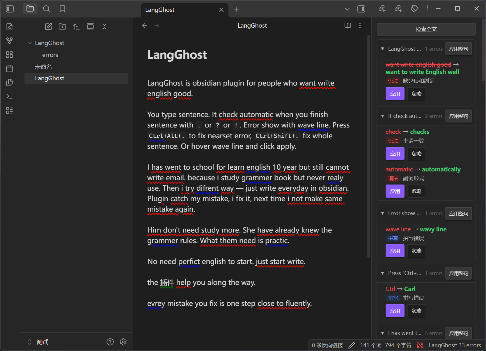

# LangGhost

不要学英语，直接用。用多了自然就会了。

Obsidian 英语写作辅助插件。写完一句自动检查，快捷键一键修复。

## 为什么做这个

学英语最大的误区：**把英语当知识学。**

背单词、刷语法书、做阅读理解——投入大量时间，结果写一封英文邮件还是要查 Google 翻译。因为"学"和"用"是两套完全不同的回路。你真正需要的不是更多教材，而是一个**能用起来**的环境。

我学双拼的时候深有体会：花 4 小时记住键位，之后每天打字就是练习。两个月后速度追上全拼。没有刻意训练，没有刷题，就是**一直在用**。

LangGhost 就是把这个方法搬到英语写作上：

- **不用专门练。** 你本来就要在 Obsidian 里写笔记、记日记、做计划——直接用英文写就好
- **即时纠错。** 写完一句，错误立刻标出来，一键修复。你不需要知道这叫"主谓不一致"，看到 `he go` 变成 `he goes`，下次就写对了
- **不是纠错本，是肌肉记忆。** 每次修正都是一次真实的写作反馈，比做 100 道语法选择题管用

语言能力的提升发生在**每一次你把错误改成正确的那一下**。不是在课本里，是在你写东西的时候。LangGhost 要做的就是让这"一下"尽可能无痛、即时、不打断思路。

不需要英语基础，不需要背任何东西。打开插件，开始写，剩下的交给时间。

## 安装

[**> 点此下载最新版 <**](https://github.com/morewhyhan/LangGhost/releases/latest/download/langghost.zip)

1. 下载 `langghost.zip`
2. 解压到你的 vault 的 `.obsidian/plugins/` 目录下（zip 内已包含 `langghost/` 文件夹，解压后目录结构应为 `.obsidian/plugins/langghost/main.js`）
3. 重启 Obsidian，或执行命令面板 → `Reload app without saving`
4. 设置 → 第三方插件 → 启用 LangGhost
5. 首次启用弹出引导面板，选择「开始使用（本地检查）」即可开箱即用；如需 AI 增强功能，选「配置 AI 增强」填写 API Key
6. 开始写

## 怎么用

**写句子。** 以 `.` `?` `!` `。` 结尾自动触发检查。状态栏显示「检查中...」提示进度，错误出现在句子里和右侧面板。

**修错误。** 三种方式：
- `Ctrl+Alt+.` 修复光标前最近的一个错误
- `Ctrl+Shift+.` 一键修复整句
- 鼠标悬停波浪线，点气泡里的「应用」

**浏览错误。** 鼠标悬停显示简洁气泡：错误类型 + 修正建议 + 应用/忽略。侧边栏按句子分组展示完整错误列表，默认折叠，点击展开查看详情。

**筛选错误。** 侧边栏顶部有类型筛选栏（全部 / 语法 / 拼写 / 表达 / 翻译），点击只看某一类错误。

**跳转错误。** 用键盘在错误间快速跳转：
- `Ctrl+Alt+]` 跳到下一个错误
- `Ctrl+Alt+[` 跳到上一个错误

**自定义快捷键。** 默认快捷键可能与其他插件冲突。如需修改：设置 → 快捷键 → 搜索 `LangGhost` → 点击对应命令的快捷键区域 → 按下你想绑定的组合键。

**中英混写。** 写着写着冒出中文？插件会把中文标绿，AI 自动给出英文翻译，点一下应用。

**检查全文。** 打开文件后侧边栏点「检查全文」扫描已有内容。或者设置里开「Auto-scan on file open」，每次打开自动扫前 10 句。

**错题本。** 每次修正自动记到 `LangGhost/errors.md`，按日期分组，翻着回顾。

## 设置

| 设置 | 默认值 | 说明 |
|------|--------|------|
| API Key | *空* | DeepSeek 或 OpenAI 兼容 API 的 key。不填只用本地检查 |
| API Endpoint | `https://api.deepseek.com/v1` | 换成任何 OpenAI 兼容地址 |
| Model | `deepseek-chat` | 模型名 |
| Error Book Path | `LangGhost/errors.md` | 记录修正历史的位置 |
| Auto-scan on file open | 关 | 打开文件时自动检查已有文本 |

## 错误类型

| 颜色 | 类型 | 来源 | 示例 |
|------|------|------|------|
| 蓝色波浪线 | 拼写 | 本地 harper.js | `recieve` → `receive` |
| 红色波浪线 | 语法 | 本地 harper.js | `he go` → `he goes` |
| 黄色波浪线 | 表达 | AI | `make a discussion` → `discuss` |
| 绿色波浪线 | 翻译 | AI / 本地 | `你好` → `Hello` |

## 快捷键

| 默认快捷键 | 命令 |
|-----------|------|
| `Ctrl+Alt+.` | Fix nearest error — 修复光标前最近的错误 |
| `Ctrl+Shift+.` | Fix all in sentence — 修复光标所在整句 |
| `Ctrl+Alt+]` | Next error — 跳到下一个错误 |
| `Ctrl+Alt+[` | Previous error — 跳到上一个错误 |

想改的话去 Obsidian 设置 → 快捷键 → 搜 `LangGhost`。

## 工作方式

两层检查，先本地后 AI：

1. **本地**（毫秒级，离线）— harper.js WASM 引擎，拼写 + 基础语法
2. **AI**（1-2秒，需 API Key）— 表达建议 + 中译英 + 复杂语法

本地结果立刻出现，AI 结果随后更新替换。纯中文自动走翻译提示词，保证可靠性。

## 环境

- Obsidian 1.5.0+
- 仅桌面端（需要 WASM）
